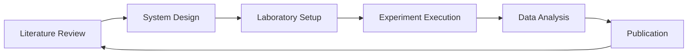

# MESSAi Integration Strategy & Future Planning

## Overview

This document outlines the comprehensive integration strategy for unifying MESSAi's distributed development across multiple branches and worktrees into cohesive deployment scenarios.

**Status**: Phase 3 (Laboratory Tools) - 40% Complete  
**Next Integration Milestone**: Phase 4 (Integration) - February 2025

## Current System Architecture

### Distributed Development State
```
┌─────────────────┐    ┌─────────────────┐    ┌─────────────────┐
│   Main Repo     │    │   Lab Worktree  │    │Research Worktree│
│   (master)      │    │ (messai-lab)    │    │(messai-research)│
│                 │    │                 │    │                 │
│ • Full Platform │    │ • Bioreactor    │    │ • 3,721 Papers  │
│ • Demo Mode     │    │ • Electroanal   │    │ • AI Insights   │
│ • Integration   │    │ • Material Opt  │    │ • Literature    │
│ • MESS Models   │    │ • Lab Tools     │    │ • Search/Filter │
└─────────────────┘    └─────────────────┘    └─────────────────┘
```

### Feature Distribution Matrix

| Feature Category | Main Repo | Lab Worktree | Research Worktree | Integration Status |
|-----------------|-----------|--------------|-------------------|-------------------|
| **Core Platform** | ✅ Master | ⚠️ Partial | ⚠️ Partial | 🔄 Ongoing |
| **Literature System** | ✅ Complete | ❌ Missing | ✅ Enhanced | 📅 Phase 4 |
| **Laboratory Tools** | ⚠️ Basic | ✅ Advanced | ❌ Missing | 📅 Phase 4 |
| **3D Visualization** | ✅ Complete | ✅ Specialized | ⚠️ Basic | ✅ Ready |
| **AI Predictions** | ✅ Complete | ✅ Lab-focused | ✅ Research-focused | 🔄 Ongoing |
| **Experiment Mgmt** | ⚠️ Basic | ⚠️ Lab-only | ❌ Missing | 📅 Phase 5 |
| **Authentication** | ✅ Complete | ⚠️ Partial | ⚠️ Partial | 📅 Phase 4 |

## Integration Timeline

### Phase 4: Integration (February-March 2025)

#### Week 1-2: Assessment & Planning
- [ ] **Feature Audit**: Complete inventory of capabilities across all worktrees
- [ ] **Dependency Mapping**: Identify cross-system dependencies
- [ ] **API Harmonization**: Standardize APIs across different implementations
- [ ] **Database Schema Unity**: Align database schemas across branches

#### Week 3-4: Literature System Integration
- [ ] **Literature → Main**: Merge enhanced literature system to master
- [ ] **Literature → Lab**: Add literature access to laboratory tools
- [ ] **Cross-References**: Link lab tools to relevant research papers
- [ ] **Unified Search**: Single search interface across systems

#### Week 5-6: Laboratory Tools Integration  
- [ ] **Lab → Main**: Merge advanced laboratory tools to master
- [ ] **Lab → Research**: Add laboratory context to research papers
- [ ] **Unified Modeling**: Integrate lab models with prediction systems
- [ ] **Workflow Integration**: Connect literature review to lab design

#### Week 7-8: System Harmonization
- [ ] **API Unification**: Single API layer for all features
- [ ] **UI/UX Consistency**: Unified design system across all features
- [ ] **Authentication Flow**: Consistent auth across all modules
- [ ] **Data Flow Integration**: Seamless data sharing between systems

### Phase 5: Experiment Platform (March-April 2025)

#### Unified Experiment Lifecycle


#### Integration Features
- **Literature-Driven Design**: Research papers inform experiment design
- **Lab-Guided Experiments**: Laboratory tools control experiment parameters
- **Real-time Integration**: Live data feeds from lab equipment
- **Collaborative Platform**: Multi-user experiment management

## Technical Integration Strategy

### Database Integration

#### Current State
```sql
-- Master Repo: Comprehensive schema with all tables
-- Lab Worktree: Focused on laboratory and material tables
-- Research Worktree: Enhanced paper and analysis tables
```

#### Target Unified Schema
```sql
-- Single source of truth for all data
-- Specialized views for different deployment scenarios
-- Consistent API layer across all implementations
```

### API Standardization

#### Current Endpoints (Distributed)
```typescript
// Master: /api/papers, /api/predictions, /api/systems
// Lab: /api/bioreactor, /api/electroanalytical, /api/materials  
// Research: /api/literature, /api/insights, /api/analysis
```

#### Target Unified API
```typescript
// Single API namespace with consistent patterns
// /api/v2/literature/* - Enhanced research capabilities
// /api/v2/laboratory/* - Advanced lab tools
// /api/v2/experiments/* - Unified experiment management
// /api/v2/insights/* - Cross-system analytics
```

### Authentication & Authorization

#### Current State
- **Master**: Full NextAuth.js implementation
- **Lab**: Partial auth, lab-focused permissions
- **Research**: Partial auth, research-focused permissions

#### Target Integration
- **Unified Auth**: Single sign-on across all modules
- **Role-Based Access**: Researcher, Lab Tech, Administrator roles
- **Feature Permissions**: Granular access to specific capabilities
- **Deployment Flexibility**: Auth can be disabled for demo/open access

## Deployment Integration Scenarios

### 1. Complete Platform Deployment
**Target**: Enterprise customers, full research institutions  
**Features**: All systems integrated, full experiment lifecycle  
**Timeline**: Phase 5 completion (April 2025)

### 2. Laboratory-Focused Deployment
**Target**: Hardware labs, equipment manufacturers  
**Features**: Lab tools + relevant literature  
**Timeline**: Phase 4 completion (March 2025)

### 3. Research-Focused Deployment
**Target**: Academic researchers, literature teams  
**Features**: Enhanced literature + basic lab modeling  
**Timeline**: Phase 4 completion (March 2025)

### 4. Demo/Educational Deployment
**Target**: Universities, demonstrations, open source  
**Features**: All features in demo mode, no auth required  
**Timeline**: Available now, enhanced in Phase 4

## Risk Mitigation

### Technical Risks

#### Data Inconsistency
**Risk**: Different data models across worktrees  
**Mitigation**: Schema harmonization in Phase 4 Week 1  
**Testing**: Comprehensive data migration testing

#### Feature Conflicts  
**Risk**: Overlapping implementations of similar features  
**Mitigation**: Feature audit and consolidation strategy  
**Resolution**: Keep best implementation, deprecate others

#### Performance Impact
**Risk**: Integration adds complexity and reduces performance  
**Mitigation**: Performance testing at each integration step  
**Monitoring**: Continuous performance benchmarking

### Project Risks

#### Integration Complexity
**Risk**: Underestimating effort required for clean integration  
**Mitigation**: Conservative timeline with 2-week buffer  
**Contingency**: Phased integration with incremental releases

#### User Experience Disruption
**Risk**: Integration changes break existing workflows  
**Mitigation**: Maintain backward compatibility during transition  
**Support**: Clear migration guides for existing users

## Success Metrics

### Technical Metrics
- **API Response Time**: < 500ms for 95% of requests
- **Feature Parity**: 100% feature availability across deployment scenarios
- **Test Coverage**: > 90% across integrated codebase
- **Build Performance**: < 5 minutes for full platform build

### User Experience Metrics
- **Workflow Completion**: Literature → Lab → Experiment in < 30 minutes
- **Cross-Feature Navigation**: < 3 clicks between any two features
- **Learning Curve**: New users productive within 2 hours
- **User Satisfaction**: > 4.5/5 for integrated platform

### Business Metrics
- **Deployment Success**: All 4 deployment scenarios functional
- **Customer Adoption**: > 80% of pilots convert to production
- **Development Velocity**: Feature development 50% faster post-integration
- **Maintenance Burden**: 30% reduction in duplicate code

## Implementation Checklist

### Pre-Integration (Current)
- [x] **Branch Cleanup**: Redundant branches removed
- [x] **Worktree Stability**: All worktrees properly stashed and clean
- [x] **Documentation**: Comprehensive branch and worktree guides
- [ ] **Feature Inventory**: Complete audit of all features across branches

### Phase 4 Preparation
- [ ] **Integration Branch**: Create dedicated integration branch
- [ ] **Test Infrastructure**: Enhanced CI/CD for integration testing
- [ ] **Migration Scripts**: Automated database schema migration
- [ ] **Rollback Strategy**: Clean rollback plan for integration failures

### Phase 4 Execution
- [ ] **Literature Integration**: Week 1-2 completion criteria met
- [ ] **Laboratory Integration**: Week 3-4 completion criteria met  
- [ ] **System Harmonization**: Week 5-6 completion criteria met
- [ ] **Deployment Testing**: All scenarios tested and verified

### Post-Integration
- [ ] **Performance Optimization**: System performance meets targets
- [ ] **Documentation Updates**: All docs reflect integrated architecture
- [ ] **Training Materials**: Updated guides for integrated platform
- [ ] **Monitoring Setup**: Comprehensive monitoring for integrated system

## Long-Term Vision

### Phase 6 and Beyond (Q2 2025+)
- **Real-time Integration**: Live data streams from laboratory equipment
- **ML-Driven Insights**: Machine learning across all data sources
- **Collaborative Research**: Multi-institution experiment coordination
- **Global Research Network**: Worldwide MESSAi research community

### Architectural Evolution
- **Microservices Transition**: Module-based architecture for easier deployment
- **Cloud-Native**: Kubernetes-ready for enterprise deployments
- **API-First**: All features accessible via comprehensive API
- **Plugin Architecture**: Third-party extensions and integrations

---

*This integration plan guides MESSAi's evolution from distributed development to unified platform. Update as integration milestones are achieved.*