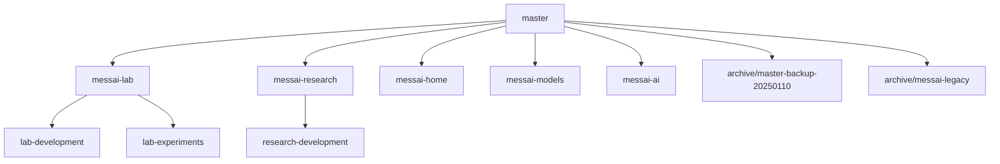

# MESSAi Branch Management Guide

## Overview

This document provides a comprehensive guide to MESSAi's branch architecture, designed for multi-agent development and specialized deployment scenarios.

**Last Updated**: 2025-07-11  
**Current Active Branches**: 17 branches across 3 worktrees

## Current Branch Structure

### 🏠 Main Worktree Branches
- **`master`** ⭐ - Main production branch with comprehensive platform
- **`messai-ai`** - AI/ML experimentation workspace  
- **`messai-home`** - Bio-inspired marketing website
- **`messai-models`** - Multi-scale MESS models integration
- **`research-development`** - Research system development branch

### 🧪 Lab Worktree (`/Users/samfrons/Desktop/messai-lab`)
- **`messai-lab`** - Laboratory tools and bioreactor design
- **`lab-experiments`** - Parameter enhancement system
- **`lab-development`** - Active lab feature development

### 🔬 Research Worktree (`/Users/samfrons/Desktop/messai-research`) 
- **`messai-research`** - Research literature and analytics system
- **`research-development`** - Research feature development

### 📚 Archive Branches
- **`archive/master-backup-20250110`** - Historical backup
- **`archive/messai-legacy`** - Legacy codebase reference

## Specialized Deployment Scenarios

### 1. **Laboratory-Only Deployment** 
**Branch**: `messai-lab`  
**Features**: Bioreactor design, electroanalytical tools, material optimization  
**Target**: University labs, research institutions focused on hardware

### 2. **Research-Only Deployment**
**Branch**: `messai-research`  
**Features**: 3,721+ papers database, AI insights, literature analytics  
**Target**: Academic researchers, literature review teams

### 3. **Combined Research + Lab**
**Branch**: `research-lab` (planned)  
**Features**: Full research capabilities + laboratory tools  
**Target**: Complete research institutions

### 4. **Full Platform**
**Branch**: `master`  
**Features**: All systems unified with experiment management  
**Target**: Enterprise deployments, complete research platforms

## Branch Relationships



## Worktree Configuration

### Active Worktrees
```bash
/Users/samfrons/Desktop/Messai           # Main worktree (master)
/Users/samfrons/Desktop/messai-lab       # Lab worktree (messai-lab)  
/Users/samfrons/Desktop/messai-research  # Research worktree (messai-research)
```

### Worktree Management Commands
```bash
# List all worktrees
git worktree list

# Add new worktree for a branch
git worktree add ../messai-new-feature feature-branch

# Remove worktree (must be clean)
git worktree remove ../messai-feature

# Move worktree location
git worktree move ../old-location ../new-location
```

## Development Workflow

### Feature Development
1. **Identify target deployment** (lab-only, research-only, full platform)
2. **Choose appropriate branch** for development
3. **Create feature branch** from target branch
4. **Develop and test** in isolation
5. **Merge back** to target branch
6. **Deploy** to specific environment

### Integration Strategy
- **Lab features** → `messai-lab` → `master`
- **Research features** → `messai-research` → `master`  
- **Cross-cutting features** → develop on `master`
- **Experimental features** → `messai-ai` → evaluate → target branch

## Stash Management

### Current Stashes (15 total)
```bash
stash@{0}: Research worktree: Save comprehensive system changes (347 files)
stash@{1}: Lab worktree: Save literature system conversion progress
stash@{2}: Main worktree: current CLAUDE.md updates and new files
stash@{3}: Main worktree: research-development cleanup
# ... (see git stash list for complete inventory)
```

### Stash Recovery
```bash
# List all stashes with details
git stash list --stat

# Apply specific stash without removing it
git stash apply stash@{n}

# Apply and remove stash
git stash pop stash@{n}

# View stash content
git stash show -p stash@{n}
```

## Branch Maintenance

### Regular Cleanup Tasks
- **Monthly**: Review and clean old feature branches
- **Quarterly**: Verify worktree health and branch relationships
- **As needed**: Archive completed features to `archive/` namespace

### Branch Naming Conventions
- **Feature branches**: `feature/descriptive-name`
- **Development branches**: `{system}-development` 
- **Experimental branches**: `{system}-{experiment}`
- **Archive branches**: `archive/{original-name}`

### Safety Guidelines
- **Always stash** uncommitted changes before major operations
- **Verify branch relationships** before deletion
- **Archive rather than delete** questionable branches
- **Test deployments** after major branch changes

## Deployment Mapping

| Deployment Type | Primary Branch | Features | Target Users |
|----------------|----------------|----------|--------------|
| **Demo/Local** | `master` | Full platform, demo mode | Developers, demos |
| **Laboratory** | `messai-lab` | Bioreactor tools only | Lab researchers |
| **Research** | `messai-research` | Literature system only | Academic research |
| **Marketing** | `messai-home` | Bio-inspired landing | Public website |
| **Enterprise** | `master` | Full platform, auth | Paid customers |

## Integration Points

### Phase-Based Development
- **Phase 3** (current): Laboratory tools on `messai-lab`
- **Phase 4** (upcoming): Integration across branches
- **Phase 5** (future): Unified experiment platform

### Cross-Branch Dependencies
- **Literature data** flows from `messai-research` to other branches
- **Laboratory models** from `messai-lab` integrate with main platform
- **AI features** developed on `messai-ai` deployed to target branches

## Troubleshooting

### Common Issues
1. **Worktree conflicts**: Check for uncommitted changes, stash if needed
2. **Branch divergence**: Use `git show-branch` to understand relationships
3. **Deployment errors**: Verify correct branch for deployment target
4. **Missing features**: Check if feature is on different specialized branch

### Recovery Procedures
1. **Lost work**: Check stash list, recent commits on all branches
2. **Corrupted worktree**: Remove and re-add worktree
3. **Branch confusion**: Review this document and verify with `git log --oneline --graph --all`

---

*This guide is maintained as part of the MESSAi development infrastructure. Update when making significant branch architecture changes.*