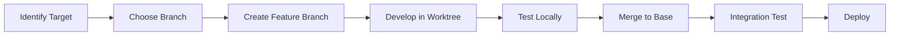

# MESSAi Branch Architecture & Worktree Management

## Overview

MESSAi uses a sophisticated multi-branch, multi-worktree architecture designed to support specialized deployments while maintaining a unified codebase. This document provides the comprehensive guide to our branch structure, worktree configuration, and deployment strategies.

**Last Updated**: 2025-01-11  
**Architecture Version**: 2.0  
**Current State**: 17 branches across 4 worktrees

## Table of Contents

1. [Architecture Philosophy](#architecture-philosophy)
2. [Worktree Configuration](#worktree-configuration)
3. [Branch Structure](#branch-structure)
4. [Deployment Scenarios](#deployment-scenarios)
5. [Development Workflow](#development-workflow)
6. [Integration Strategy](#integration-strategy)
7. [Best Practices](#best-practices)
8. [Troubleshooting](#troubleshooting)

## Architecture Philosophy

### Why Multi-Worktree?

MESSAi's architecture addresses several key requirements:

1. **Specialized Deployments**: Different institutions need different feature sets
2. **Parallel Development**: Multiple teams working on distinct features
3. **Clean Separation**: Avoid feature bleeding between deployment targets
4. **Flexible Integration**: Easy to combine features when needed

### Core Principles

- **Isolation**: Each worktree focuses on specific functionality
- **Integration**: Clear paths for merging features when ready
- **Flexibility**: Support various deployment scenarios
- **Maintainability**: Minimize code duplication and conflicts

## Worktree Configuration

### Active Worktrees

```bash
# Main Development Worktree
/Users/samfrons/Desktop/Messai           
├── Branch: master (primary)
├── Purpose: Full platform integration
├── Features: All systems, demo mode
└── Status: Active development

# Laboratory Tools Worktree  
/Users/samfrons/Desktop/messai-lab       
├── Branch: messai-lab
├── Purpose: Laboratory-only deployments
├── Features: Bioreactor, electroanalytical, materials
└── Status: Phase 3 development

# Research System Worktree
/Users/samfrons/Desktop/messai-research  
├── Branch: messai-research
├── Purpose: Research/literature system
├── Features: 3,721+ papers, AI insights
└── Status: Enhancement ongoing

# Marketing/Landing Worktree
/Users/samfrons/Desktop/messai-home      
├── Branch: messai-home
├── Purpose: Bio-inspired marketing site
├── Features: Public-facing landing page
└── Status: Design phase
```

### Worktree Management Commands

```bash
# List all worktrees with details
git worktree list -v

# Add new worktree for feature development
git worktree add ../messai-feature feature-branch

# Remove worktree (ensure clean first)
git worktree remove ../messai-feature

# Move worktree to new location
git worktree move ../old-path ../new-path

# Prune stale worktree references
git worktree prune
```

## Branch Structure

### Production Branches

#### 🌟 **master**
- **Purpose**: Main production branch with full platform
- **Features**: Complete MESSAi experience
- **Deployment**: Production app.messai.io
- **Status**: Stable, integration target

#### 🧪 **messai-lab**  
- **Purpose**: Laboratory tools only
- **Features**: Bioreactor design, electroanalytical tools
- **Target Users**: Lab researchers, equipment manufacturers
- **Deployment**: lab.messai.io (planned)

#### 📚 **messai-research**
- **Purpose**: Research and literature system
- **Features**: Paper database, AI insights, analytics
- **Target Users**: Academic researchers
- **Deployment**: research.messai.io (planned)

#### 🏠 **messai-home**
- **Purpose**: Marketing and landing page
- **Features**: Bio-inspired design, product overview
- **Target Users**: Public visitors
- **Deployment**: messai.io main site

### Development Branches

#### 🔬 **research-development**
- **Base**: messai-research
- **Purpose**: Active research feature development
- **Merges To**: messai-research → master

#### 🔧 **lab-development**
- **Base**: messai-lab
- **Purpose**: Laboratory feature development
- **Merges To**: messai-lab → master

#### 📊 **messai-models**
- **Base**: master
- **Purpose**: Multi-scale MESS models
- **Status**: Integration pending

#### 🤖 **messai-ai**
- **Base**: master
- **Purpose**: AI/ML experimentation
- **Status**: Experimental features

### Specialized Branches

#### 🧬 **lab-experiments**
- **Purpose**: Parameter system enhancement
- **Base**: messai-lab
- **Features**: Advanced parameter management

#### 🔄 **experiments** (planned)
- **Purpose**: Experiment management platform
- **Timeline**: Phase 5

#### 🔗 **research-lab** (planned)
- **Purpose**: Combined research + lab deployment
- **Timeline**: Phase 4 integration

### Archive Branches

- **archive/master-backup-20250110**: Historical backup
- **archive/messai-legacy**: Legacy codebase reference

## Deployment Scenarios

### 1. Laboratory-Only Deployment

```yaml
Branch: messai-lab
URL: lab.messai.io
Features:
  - Bioreactor design tools
  - Electroanalytical modeling
  - Material optimization
  - 3D visualization
  - No authentication required
Target: University labs, research facilities
```

### 2. Research-Only Deployment

```yaml
Branch: messai-research  
URL: research.messai.io
Features:
  - 3,721+ research papers
  - AI-powered insights
  - Literature analytics
  - Advanced search/filter
  - Citation networks
Target: Academic researchers, literature teams
```

### 3. Combined Research + Lab

```yaml
Branch: research-lab (planned)
URL: platform.messai.io
Features:
  - Full research database
  - Complete lab tools
  - Integrated workflows
  - Cross-referencing
Target: Complete research institutions
```

### 4. Full Enterprise Platform

```yaml
Branch: master
URL: app.messai.io
Features:
  - All systems integrated
  - Experiment management
  - Team collaboration
  - Full authentication
  - Enterprise features
Target: Commercial deployments
```

### 5. Demo/Educational

```yaml
Branch: master (demo mode)
URL: demo.messai.io
Features:
  - All features available
  - No authentication
  - Sample data only
  - Educational content
Target: Universities, demonstrations
```

## Development Workflow

### Feature Development Process



### Branch Strategy by Feature Type

#### Laboratory Features
```bash
# Start from lab worktree
cd /Users/samfrons/Desktop/messai-lab
git checkout lab-development
git checkout -b feature/new-bioreactor-model

# Develop and test
# ...

# Merge back
git checkout lab-development
git merge feature/new-bioreactor-model
```

#### Research Features
```bash
# Start from research worktree
cd /Users/samfrons/Desktop/messai-research
git checkout research-development
git checkout -b feature/enhanced-search

# Develop and test
# ...

# Merge back
git checkout research-development
git merge feature/enhanced-search
```

#### Cross-Cutting Features
```bash
# Develop on master for features affecting multiple systems
cd /Users/samfrons/Desktop/Messai
git checkout master
git checkout -b feature/unified-auth
```

### Stash Management

Current stash inventory (15 stashes) contains important work:

```bash
# View all stashes with statistics
git stash list --stat

# Apply specific stash without removing
git stash apply stash@{0}

# Show detailed stash content
git stash show -p stash@{0}

# Create descriptive stash
git stash push -m "Feature: Enhanced parameter system"
```

## Integration Strategy

### Phase-Based Integration Plan

#### Phase 3 (Current): Laboratory Tools
- **Status**: 40% complete
- **Focus**: Complete lab tool development
- **Worktree**: messai-lab

#### Phase 4 (Feb-Mar 2025): System Integration
- **Goal**: Unify lab and research systems
- **Tasks**:
  - Merge research enhancements to master
  - Integrate lab tools with literature
  - Standardize APIs across systems
  - Create unified deployment options

#### Phase 5 (Mar-Apr 2025): Experiment Platform
- **Goal**: Complete experiment management
- **Tasks**:
  - Build experiment lifecycle tools
  - Connect all systems
  - Enable collaborative features

### Integration Checkpoints

1. **Feature Compatibility**: Ensure no conflicts
2. **API Consistency**: Standardize endpoints
3. **Database Harmony**: Align schemas
4. **UI/UX Unity**: Consistent design system
5. **Performance Validation**: No regression

## Best Practices

### Worktree Guidelines

1. **Keep Worktrees Clean**
   - Commit or stash before switching branches
   - Use descriptive stash messages
   - Regular cleanup of completed features

2. **Avoid Cross-Worktree Dependencies**
   - Each worktree should be self-contained
   - Use integration branches for shared features

3. **Regular Synchronization**
   - Pull updates from origin regularly
   - Keep development branches up-to-date with base

### Branch Management

1. **Naming Conventions**
   ```
   feature/descriptive-name      # New features
   fix/issue-description         # Bug fixes
   enhance/existing-feature      # Improvements
   experiment/proof-of-concept   # Experiments
   ```

2. **Lifecycle Management**
   - Create from appropriate base branch
   - Regular commits with clear messages
   - Clean merge back to base
   - Delete after successful merge

3. **Protection Rules**
   - Never force push to production branches
   - Require reviews for production merges
   - Maintain clean commit history

### Code Organization

1. **Feature Isolation**
   - Lab features stay in lab directories
   - Research features in research directories
   - Shared utilities in common locations

2. **Import Discipline**
   - No lab imports in research code
   - No research imports in lab code
   - Shared imports from common only

## Troubleshooting

### Common Issues

#### Worktree Conflicts
```bash
# Error: worktree already exists
git worktree remove --force ../conflicted-worktree
git worktree add ../new-worktree branch-name
```

#### Branch Divergence
```bash
# Visualize branch relationships
git log --graph --all --oneline --decorate

# Check specific branch divergence
git show-branch master messai-lab messai-research
```

#### Stash Recovery
```bash
# List all stashes including dropped ones
git fsck --unreachable | grep commit | cut -d' ' -f3 | xargs git log --oneline --no-walk

# Recover specific dropped stash
git stash apply {commit-hash}
```

### Recovery Procedures

1. **Lost Work Recovery**
   - Check all worktree stashes
   - Review reflog for recent commits
   - Use git fsck for orphaned objects

2. **Worktree Corruption**
   ```bash
   # Remove corrupted worktree
   rm -rf ../corrupted-worktree
   git worktree prune
   
   # Re-add clean worktree
   git worktree add ../new-worktree branch-name
   ```

3. **Branch Confusion**
   ```bash
   # Show current state across all worktrees
   for dir in /Users/samfrons/Desktop/messai*; do
     echo "=== $dir ==="
     git -C "$dir" status -sb
   done
   ```

## Monitoring & Maintenance

### Weekly Tasks
- Review uncommitted changes in all worktrees
- Clean up completed feature branches
- Update stash descriptions

### Monthly Tasks
- Prune stale worktree references
- Archive old feature branches
- Review branch divergence

### Quarterly Tasks
- Comprehensive architecture review
- Update this documentation
- Plan integration milestones

## Appendix: Quick Reference

### Essential Commands
```bash
# Worktree operations
git worktree list -v              # List all worktrees
git worktree add PATH BRANCH      # Add new worktree
git worktree remove PATH          # Remove worktree

# Branch operations
git branch -a                     # List all branches
git checkout -b NEW BASE          # Create new branch
git branch -d BRANCH              # Delete branch

# Stash operations  
git stash list                    # List stashes
git stash push -m "MESSAGE"       # Create stash
git stash apply stash@{N}         # Apply stash

# Integration operations
git merge --no-ff BRANCH          # Merge with commit
git cherry-pick COMMIT            # Copy specific commit
git rebase -i BASE                # Interactive rebase
```

### Deployment Commands
```bash
# Lab deployment
npm run deploy:lab

# Research deployment  
npm run deploy:research

# Full platform deployment
npm run deploy:full

# Demo deployment
npm run deploy:demo
```

---

*This document is the authoritative guide for MESSAi's branch architecture. Update when making significant architectural changes.*